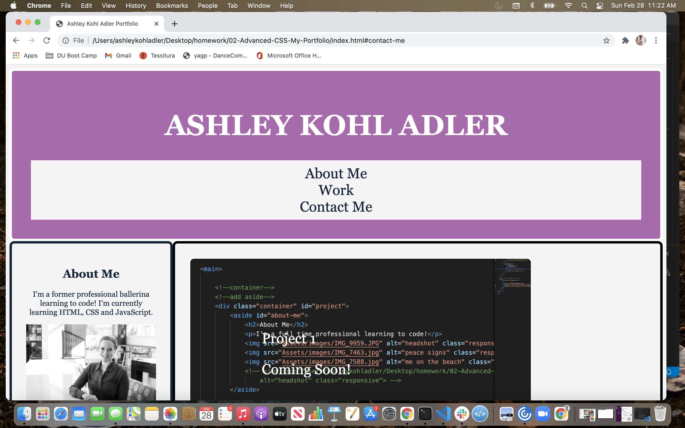

# 02-Advanced-CSS-My-Portfolio

1. [Description](#Description)
2. [Features](#Features)
3. [Installation](#installation)
3. [License](#License)
4. [Contributing](#Contributing)
5. [Questions](#Questions)
6. [Screenshot](#screenshot)

# Description 

The purpose of this task is to create a portfolio that includes and About Me, Contact Details and examples of work. Links in the navigation will redirect to the correct section related to the link. 

# Features
- Express.js
- Node.js
- NPM
- MySQL
- Sequelize
- dotENV
- express-handlebars
- bcrypt

# License

## This application is covered by the MIT license. 

# Contributing
Contributions are excepted. Fill free to fork. 

# Questions
## GitHub User name 
ashleykohladler

## Link to Website
https://ashleykohladler.github.io/02-Advanced-CSS-My-Portfolio/

## Screenshot

